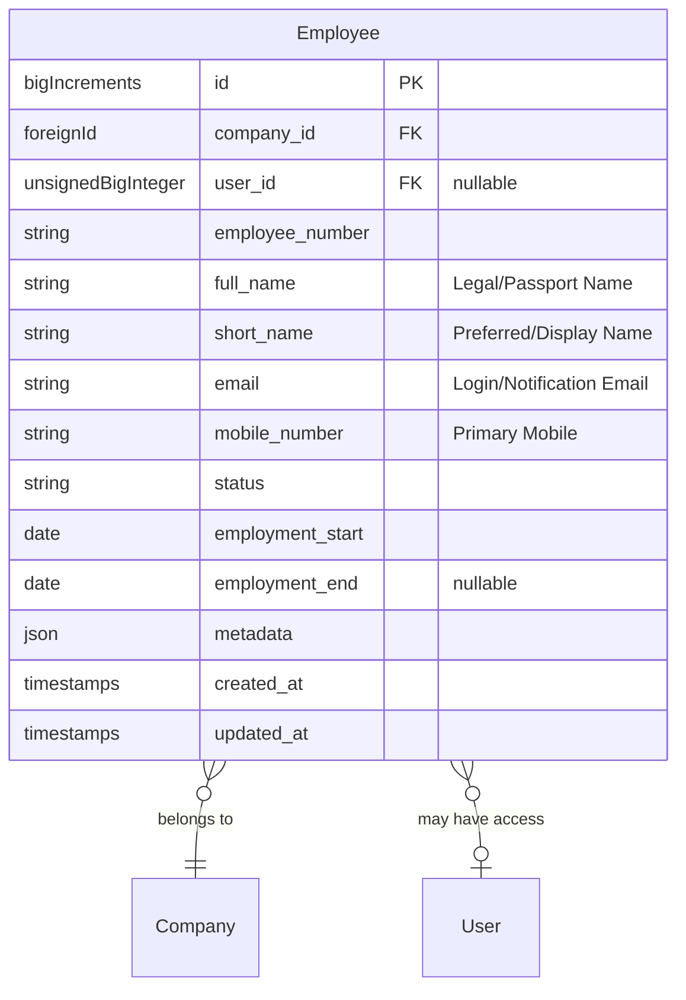

# BLB Employee Module Architecture - High-Level Overview

## Core Philosophy

The BLB Employee Module is a **foundational Core module** that every Belimbing deployment requires. Unlike optional business modules, the Employee module is always present because:

1. **Every company has people** - Employees are fundamental to any business operation
2. **People records are universal** - Multiple modules need employee data (HR, payroll, timesheets, projects)
3. **Separation of concerns** - Employee management is distinct from Company organizational structure

The module provides **lightweight employee records** that can be extended by vendor packages (HR module, payroll systems, etc.).

**Key Distinction:**
- **Employee**: Someone who works for a company (foundational concept)
- **User**: Someone with system login credentials (may or may not be an employee)
- **Relationship**: Employee → User (optional) - An employee may have system access, but not all employees do

---

## Foundation Layer (Core BLB)

### Essential Employee Management

The foundation provides the **core functionality** needed for any ERP deployment:

- **Basic Employee Model**: Name, employee number, employment status, basic contact info
- **Employee-Company Relationship**: Employee belongs to a company (via `company_id`)
- **Employee-User Relationship**: Employee can optionally link to User (via `user_id`) - employees may or may not have system access
- **Employment Status**: Active, inactive, terminated, on leave
- **Employment Dates**: Start date, end date (for historical tracking)

### Foundation Design Principles

- **Minimal but Complete**: Everything needed to track employees, nothing that limits extension
- **Lightweight Design**: Foundation provides minimal employee data; HR module extends with payroll, benefits, etc.
- **Extension Points**: Traits, interfaces, and hooks for vendors to attach to
- **No Assumptions**: Doesn't assume business logic or specific HR processes

### Employee Status Management

Foundation provides basic employment lifecycle:

- **Active**: Currently employed and working
- **Inactive**: On leave, sabbatical, or temporary suspension
- **Terminated**: Employment ended (with end date)
- **Pending**: New hire, not yet started

---

## Data Model Overview

### Key Tables

| Table | Purpose |
|-------|---------|
| `employees` | Core employee records with company and optional user link |

### Employee Model Fields

| Field | Type | Purpose |
|-------|------|---------|
| `id` | BigIncrements | Primary key |
| `company_id` | ForeignId | Foreign key to Company (required) |
| `user_id` | UnsignedBigInteger | Foreign key to User (nullable - employee may not have system access) |
| `employee_number` | String | Unique identifier within company |
| `full_name` | String | Official full name as per ID/Passport (MRZ standard) |
| `short_name` | String | Preferred name or short display name (nullable) |
| `email` | String | Primary work email (nullable) |
| `mobile_number` | String | Primary mobile number (nullable) |
| `status` | String | Employment status (active, inactive, terminated, pending) |
| `employment_start` | Date | Employment start date |
| `employment_end` | Date | Employment end date (nullable) |
| `metadata` | JSON | Additional flexible data for extensions |

---

## Vendor Extension Layer

### How Vendors Extend the Foundation

Even with the lightweight foundation, vendors can add specialized functionality:

#### Trait-Based Extensions

Vendors provide traits that the Employee model can optionally use:

- **Advanced Profile Management**: Extended personal information, emergency contacts, dependents
- **Skills & Qualifications**: Certifications, licenses, competencies
- **Performance Management**: Performance reviews, goals, ratings
- **Leave Management**: Leave balances, leave requests, accruals

#### Model Relationships

Vendors add new database tables and relationships:

- **HR Module Extensions**: Payroll, benefits, performance reviews, leave management
- **Timesheet Integration**: Time tracking, attendance, schedules
- **Project Assignments**: Employee-project relationships, roles, allocations
- **Expense Management**: Expense reports, reimbursements
- **Learning & Development**: Training records, courses, certifications

#### Service Integration

Vendors provide services that integrate with the foundation:

- **Payroll Systems**: Integration with payroll providers
- **HRIS Integration**: Sync with external HR information systems
- **Background Checks**: Integration with screening services
- **Communication**: Employee-specific notifications, announcements

---

## Key Design Decisions

| Decision | Rationale |
|----------|-----------|
| **Employee as Core Module** | Every deployment has employees; always required |
| **Employee → User (Optional)** | Not all employees need system access; separation of concerns |
| **Lightweight Foundation** | Foundation provides minimal data; HR module extends with complex features |
| **Company Relationship Required** | Every employee belongs to a company; organizational context is essential |
| **Separate from Company Module** | Employee management is distinct from organizational structure management |

---

## Real-World Scenarios

### Manufacturing Company

- **Factory Workers**: Employees without system access (no User link)
- **Office Staff**: Employees with system access (linked to User)
- **Management**: Employees with full system access (linked to User with admin roles)

### Professional Services Firm

- **Consultants**: Employees with system access for project management
- **Support Staff**: Employees with limited system access
- **Contractors**: May be employees or external (handled via Company relationships)

### Retail Chain

- **Store Employees**: Employees at each location (belong to company, may have portal access)
- **Head Office Staff**: Employees with full system access
- **Part-Time Workers**: Employees with minimal or no system access

---

## Relationship with Other Modules

### Company Module

- **Employee belongs to Company**: Every employee has a `company_id` (required)
- **Organizational Context**: Employee's company provides organizational structure
- **Multi-Company Support**: Employees can potentially belong to multiple companies (future extension)

### HR Module (Vendor Extension)

- **Extends Foundation Employee**: HR module adds payroll, benefits, performance reviews, leave management
- **Foundation Provides Base**: Employee model with basic info, employment status, optional user link
- **HR Module Adds**: Payroll records, benefits enrollment, performance data, leave balances, etc.

### Other Business Modules

- **Timesheet Module**: References employees for time tracking
- **Project Module**: References employees for project assignments
- **Expense Module**: References employees for expense reports
- **Learning Module**: References employees for training records

---

## Extension Mechanism Flow

### How It All Works Together

1. **Foundation Provides Base**: Employee + company relationship + optional user link work standalone
2. **Vendors Add Features**: HR, payroll, timesheets, etc.
3. **Auto-Discovery**: System automatically detects and enables vendor features
4. **Graceful Degradation**: If vendor packages are missing, foundation still works
5. **Layered Override**: Vendors can override foundation behavior when needed

### Example Employee Journey

#### Basic Foundation Employee

- Employee created with name, employee number, company assignment
- Basic contact information stored
- Employment status tracked
- Optionally linked to User (if they have system access)

#### With HR Vendor Package

- Same foundation experience
- **Plus** payroll management per employee
- **Plus** benefits enrollment and administration
- **Plus** performance reviews and leave management
- **Plus** extended employee data and workflows

#### With Timesheet Vendor Package

- Same foundation + HR experience
- **Plus** time tracking and attendance
- **Plus** schedule management
- **Plus** overtime calculations

---

## Benefits of This Architecture

### For Foundation Development

- **Focus**: Core team focuses on essential employee functionality
- **Stability**: Foundation rarely changes, providing stable base
- **Testing**: Easier to test and maintain smaller codebase
- **Performance**: Optimized for common employee operations

### For Vendor Development

- **Flexibility**: Can add any employee-related functionality
- **Independence**: Develop and test features independently
- **Reusability**: Same vendor package works across BLB installations
- **Market Opportunity**: Can sell specialized employee management features

### For End Users/Clients

- **Completeness**: Essential employee features available out-of-box
- **Customization**: Add extensions for specific industry needs
- **Scalability**: Start simple, add complexity as business grows
- **Future-Proof**: Add capabilities without system rewrites

---

## Future Extensibility

The architecture supports unlimited growth:

- **Multi-Company Employees**: Employees working for multiple companies (matrix organizations)
- **Contractor Management**: Distinguish between employees and contractors
- **Skills Marketplace**: Internal talent marketplace, skill matching
- **AI-Powered Insights**: Employee performance predictions, retention analysis
- **Advanced Analytics**: Workforce planning, headcount forecasting

The foundation remains stable while innovation happens in the vendor layer, providing reliability and unlimited extensibility.

